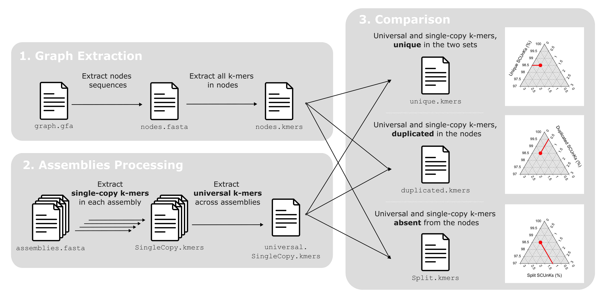

**P**an**G**enome **S**ingle **C**opy and **Un**iversal **K**-mer counter (**PG-SCUnK**) aims to measure pan-genome graph quality using single-copy and universal *k*-mers.  
We assume that single-copy *k*-mers found in an assembly and universally present across all assemblies are orthologous, and should be found uniquely and in their full length in the nodes of the graph.

We thus propose simple metrics to describe a pan-genome graph based on the proportion of single-copy and universal *k*-mers composing the assemblies that are:
- _**Unique**_: Present only once and in full length in one of the nodes of the graph.
- _**Duplicated**_: Present multiple times in the graph.
- _**Split**_: Fragmented over different nodes due to the aggregation of non-orthologous sequences.

The pipeline relies on [KMC](https://github.com/refresh-bio/KMC) to identify single-copy *k*-mers shared by all the assemblies (i.e., universal) composing a pan-genome graph.

bellow is a schematic representation of the `PG-SCUnK` workflow, please read the [associated publication](https://www.biorxiv.org/content/10.1101/2025.04.03.646777v1) for details.



---

## Installation

### Install the dependencies in a dedicated environment.

**_`PG-SCUnK`_** requires `kmc` and `kmc_tools`  to be installed and available in your `$PATH`.
Companions scripts also require `samtools` and `vg` for **_`GFA2HaploFasta.bash`_**, `zlib` and `R` for **_`PG-SCUnK_plot.R`_** as well as `bwa` and `bedtools` for **_`FindSCUnKsRegions.bash`_**.

All the dependence can be installed by running:

```
# Using mamba 
mamba install bioconda::kmc=3.2.4 bioconda::samtools=1.21 bioconda::vg=1.65.0 conda-forge::zlib=1.3.1 conda-forge::r-base bioconda::bwa=0.7.19 bioconda::bedtools=2.31.1 

# Using conda
# conda install bioconda::kmc=3.2.4 bioconda::samtools=1.21 bioconda::vg=1.65.0 conda-forge::zlib=1.3.1 conda-forge::r-base bioconda::bwa=0.7.19 bioconda::bedtools=2.31.1 
```

Creating a dedicated environment is a convenient way to ensure no interference with other software.

```
# Using mamba 
mamba create -n PG-SCUnK-env bioconda::kmc=3.2.4 bioconda::samtools=1.21 bioconda::vg=1.65.0 conda-forge::zlib=1.3.1 conda-forge::r-base bioconda::bwa=0.7.19 bioconda::bedtools=2.31.1 
# then load the environment before running PG-SCUnK with:

mamba activate PG-SCUnK-env

# Using conda
# conda create -n PG-SCUnK-env bioconda::kmc=3.2.4 bioconda::samtools=1.21 bioconda::vg=1.65.0 conda-forge::zlib=1.3.1 conda-forge::r-base bioconda::bwa=0.7.19 bioconda::bedtools=2.31.1 
# conda activate PG-SCUnK-env
```

### clone the directory

Download `PG-SCUnK`:

```
git clone https://github.com/cumtr/PG-SCUnK.git
```

### test run

To test `PG-SCUnK`, run:

```
cd PG-SCUnK
chmod +x ./PG-SCUnK
./PG-SCUnK
```

This command should print the help line for `PG-SCUnK`:

`Usage: ./PG-SCUnK -p <panGenome> -a <path/to/assemblies/> -o <outputDir/outputBasename> -t <WorkDir> (-k <kmer_size> -v)`

---

## Running PG-SCUnK

To run, PG-SCUnK require four informations:
- **`-p`** path to the graph in `.gfa` format
- **`-a`** path to the directory where all the assemblies that compose the graph are stored (`PG-SCUnK` assumes all the files is this directory than ends with `.fasta` are the assemblies to consider)
- **`-o`** the path + basename of the output file
- **`-t`** the working directory for `PG-SCUnK` to write temporary files

two other optional parameters can be provided: 
- **`-k`** sets the *k*-mer size for `PG-SCUnK` use. default value is 100.
- **`-v`** state for the level of verbose. adding this flag (no values expected) make PG-SCUnK really verbose. mostly useful for debugging.

A typical command would be:
```
# mamba activate PG-SCUnK-env
./PG-SCUnK -p ./MyPanGenomeGraph.gfa -a ./InputAssemblies/ -o ./OutputPG-SCUnK/MyPanGenomeGraph.PG-SCUnK -t ./TEMP/ -k 100
```

This command produces five distinct files:

- `./OutputPG-SCUnK/MyPanGenomeGraph.PG-SCUnK.stats.txt` : Contains counts of _**single-copy and universal**_ *k*-mers, _**unique**_ *k*-mers, _**duplicated**_ *k*-mers, and _**split**_ *k*-mers in the graph.

the four other files report the *k*-mers for the different categories:

- `./OutputPG-SCUnK/MyPanGenomeGraph.PG-SCUnK.all.txt`: List of all _**Single-Copy and Universal**_ *k*-mers.
- `./OutputPG-SCUnK/MyPanGenomeGraph.PG-SCUnK.unique.txt`: List of _**unique**_ *k*-mers.
- `./OutputPG-SCUnK/MyPanGenomeGraph.PG-SCUnK.duplicated.txt`: List of _**duplicated**_ *k*-mers.
- `./OutputPG-SCUnK/MyPanGenomeGraph.PG-SCUnK.split.txt`: List of _**split**_ *k*-mers.
- `./OutputPG-SCUnK/MyPanGenomeGraph.PG-SCUnK.log`: log file.

---

## Recommandations while using PG-SCUnK

**PG-SCUnK** its companion scripts are designed to assess pan-genome graph quality using single-copy and universal *k*-mers.  
Before running the tools, ensure that the graph has not been trimmed and contains the complete assemblies (e.g., raw output from tools `pggb` or `minigraph-cactus` for example) 
**PG-SCUnK** assumes that sequence names follow the PanSN naming scheme. If your sequences use a different naming scheme, the tool may still run, but we cannot guarantee the quality or accuracy of the results.

---

## Choosing the best *k*-mer size

The **`-k`** parameter, which sets the *k*-mer size, is the only parameter that the user can specify in the PG-SCUnK workflow.
Choosing the best possible k requires understanding a few key aspects of how `PG-SCUnK` works.

**Even or Odd?**

Unlike many programs, `PG-SCUnK` does not require *k*-mers to be odd. This is because it uses canonical *k*-mers: any *k*-mer and its reverse complement are treated as the same unique *k*-mer, regardless of their length.

**Not too big, Not too small**

In our tests (see the associated publication for details), `PG-SCUnK` results are robust to *k*-mer size as long as the size is not too large.
When *k*-mers are too long, they are more likely to be broken by polymorphisms. As a result, their number decreases, reducing the genome’s representation.
When *k*-mers are too short, the opposite problem occurs: they tend to lack specificity, making them less unique and less universal.

Our tests suggest that choosing a k value between 31 and 150 provides consistent results.
The default value, 100, performed well in our benchmarking but we strongly advise you to run `PG-SCUnK` with different `-k` value and check the conscistency of the resutls.

---

## Companion scripts

`PG-SCUnK` comes with companion scripts.

## 

**`scripts/GFA2HaploFasta.bash`**

This script is useful to extract the assemblies from a graph. Before using it, **make sure the graph was not trimmed in any way and contain the full assemblies** (raw output from `pggb` or `minigraph-cactus` for example) and that **the name of the sequences follow the [PanSN](https://github.com/pangenome/PanSN-spec) naming scheme**. This script accept graph in .gfa format.

`Usage: ./scripts/GFA2HaploFasta.bash -p <panGenome.gfa> -t <tempDir> -o <outDir> -@ <threads>`

this script requires `samtools` and `vg` to be present in you path. you can install them in the environment using: 
`mamba install -n PG-SCUnK-env bioconda::samtools=1.21 bioconda::vg=1.65.0`

## 

**`scripts/PG-SCUnK_plot.R`**

this script uses `R` to make a ternary plot for a given a `.stats.txt` output file from `PG-SCUnK`.

`Usage: ./scripts/GFA2HaploFasta.bash -p <panGenome.gfa> -t <tempDir> -o <outDir> -@ <threads>`

This script will produce a [*ternary plot*](https://en.wikipedia.org/wiki/Ternary_plot) as illustrated bellow. 


**How to read a ternary plot:**
A ternary plot is a triangular diagram where each point represents a mixture of three components that sum to 100%.
    Each corner stands for 100% of one component and 0% of the others.
    Each point inside the triangle reflects a specific proportion of all three.

To estimate values for a point:
    Draw lines from the point parallel to the side opposite each corner.
    Where each line intersects the triangle’s edge indicates the percentage of that component.
    The sum of the three percentages will always equal 100%.
    Points closer to a corner = more of that component.
    Points near an edge = less of the component at the opposite corner.

In the example above, the dot corespond to a graph with XXXX % of unique SCUnKs, XXX % of duplicated SCUnKs and XXX % of split SCUnKs.

You can install the dependancy required by `PG-SCUnK_plot.R` in the environment using : 
`mamba install -n PG-SCUnK-env bioconda::R=0.9.0`

## 

**`scripts/FindSCUnKsRegions.bash`**

this script uses `bwa`, `samtools`, `bedtools` and `R` to identify the location of the unique, duplicated and split SCUnKs in a given reference genome.
It uses the `.unique.txt`, `.duplicated.txt` and the `.split.txt` output file from `PG-SCUnK`.

`Usage: ./scripts/FindRegions.bash -b <basename> -r <reference> -t <tempDir> -o <outDir> -@ <threads>`

This script will produce new files in the proivided `OutDir`:

- `.SCUnKs.unique.bed`: a bed file with the coordinates of the regions covered by **_unique_** SCUnKs.
- `.SCUnKs.duplicated.bed`: a bed file with the coordinates of the regions covered by **_unique_** SCUnKs.
- `.SCUnKs.colapsed.bed`:: a bed file with the coordinates of the regions covered by **_unique_** SCUnKs.
- `.SCUnKs.log`: log file.

This script will also produce a plot `.SCUnKs.position.png` presenting the distribtion of the _unique_, _duplicated_ and _split_ SCUnKs along the reference genome, as illustrated bellow. 


In this plot, the header reports the name of the linear genome used as the reference, along with the proportion of the genome covered by SCUnKs (in this case, 19.92%). The numbers in square brackets indicate the proportions of the genome covered by Unique (U), Duplicated (D), and Split (S) SCUnKs.
Below, each track represents the locations of each SCUnK type along the linear genome.

You can install the dependances required by `FindSCUnKsRegions.bash` in the environment using : 
`mamba install -n PG-SCUnK-env bioconda::bwa=0.7.19 bioconda::samtools=1.21 bioconda::bedtools=2.31.1 bioconda::R=0.9.0`

---

## Example of workflow

Here is an example of workflow to run `PG-SCUnK` for a pan-genome build for 50 e.coli and published [here](https://www.nature.com/articles/s41592-024-02430-3)

```
# Download and uncompress the graph in .gfa format.
wget https://zenodo.org/records/7937947/files/ecoli50.gfa.zst
unzstd ecoli50.gfa.zst 

# create a temporary working directory
mkdir TEMP

# run the first script to extract all the assemblies from the graph.
bash /path/to/PG-SCUnK/scripts/GFA2HaploFasta.bash -p ecoli50.gfa -t TEMP -o ecoli50 -@ 1

# Run PG-SCUnK
/path/to/PG-SCUnK/PG-SCUnK -p ecoli50.gfa -a ecoli50 -o Out_PG-SCUnK/ecoli50 -t TEMP -k 100

# Create a Ternary plot of the results from PG-SCUnK. Running this script for the first time takes some time to install the packages and their dependances.
Rscript --vanilla /path/to/PG-SCUnK/scripts/PG-SCUnK_plot.R Out_PG-SCUnK/ecoli50.stats.txt Out_PG-SCUnK/ecoli50.out.pdf

# Locate the SCUnKs along the reference genome
bash /path/to/PG-SCUnK/scripts/FindSCUnKsRegions.bash -b Out_PG-SCUnK/ecoli50 -r ecoli50/GCF_016403625.2*.fasta -t TEMP -o Out_PG-SCUnK/ -@ 1
```

---

## Citation

If you use `PG-SCUnK`, please cite our [paper](https://www.biorxiv.org/content/10.1101/2025.04.03.646777v1).

---

## New Ideas ?

If you think of a possible improvement to the `PG-SCUnK` workflow (or useful new companion script[s]), please DM me at t.cumer.sci[@]gmail.com or open a new issue.

---

## Licence

`PG-SCUnK` software is distributed under [GNU GPL 3 license](https://www.gnu.org/licenses/gpl-3.0.txt).
